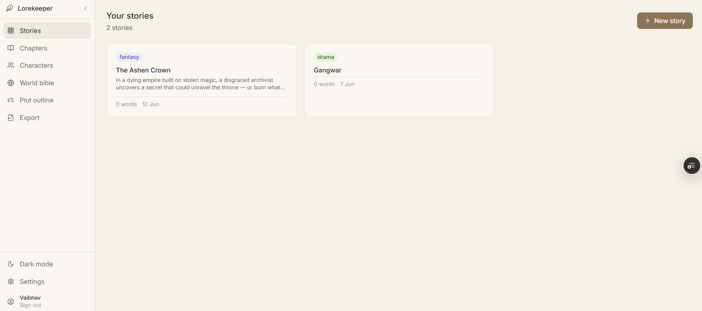
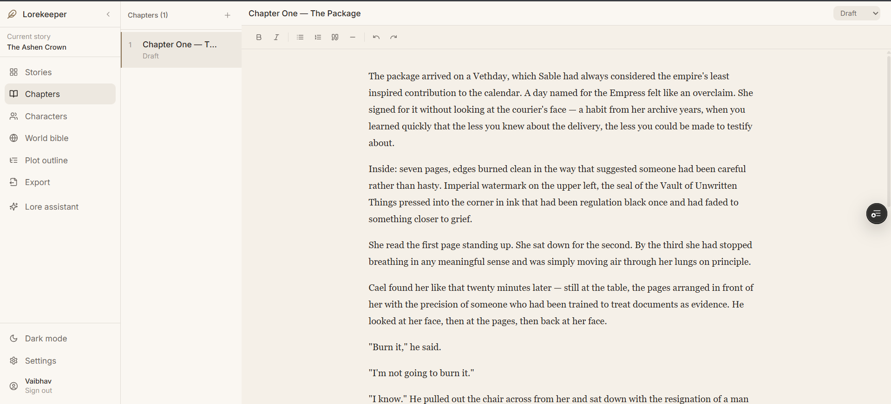
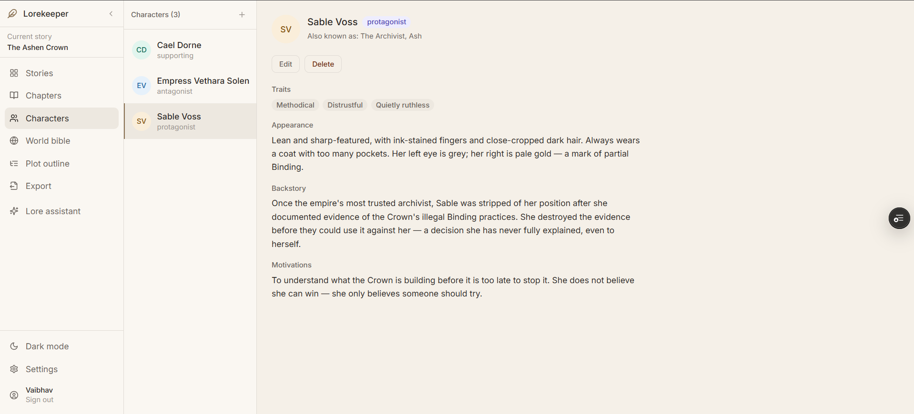
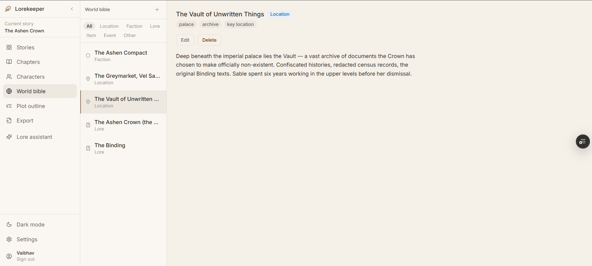
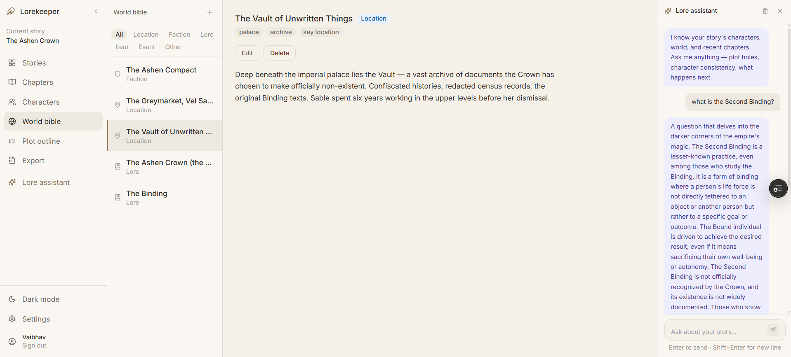

# Lorekeeper

**A unified writing workspace for storytellers.**

Most writers juggle Scrivener for drafts, Notion for character notes, and Google Docs for everything else. Lorekeeper puts it all in one place — with an AI assistant that has actually read your story before you ask it anything.

**Live demo → [lore-keepers.vercel.app](https://lore-keepers.vercel.app)**

> Try the template story on the dashboard to see a fully populated workspace instantly.

---

## Screenshots

### Dashboard


### Chapter Editor


### Characters Wiki


### World Bible


### Lore Assistant


---

## The problem

Existing tools solve one part of the problem well:

| Tool | What it does well | The gap |
|---|---|---|
| Scrivener | Long-form drafting | Desktop-only, steep learning curve, dated UI |
| World Anvil | Worldbuilding | Not a writing tool, overwhelming for casual use |
| Notion | Flexible notes | Generic — you build the system yourself, no editor features |
| AI writing tools | Suggestions | Generic AI with no knowledge of your specific story |

Lorekeeper combines a clean editor, a structured story wiki, and an AI that reads your lore — in one web-based workspace, free.

---

## Features

- **Chapter editor** — Tiptap-based rich text editor with autosave, word count, and status tracking (Idea / Draft / Revised / Done)
- **Characters wiki** — Per-story character profiles with name, aliases, role, traits, appearance, backstory, and motivations
- **World bible** — Structured entries for locations, factions, lore, items, and events — filterable by type
- **Plot outline** — Scene-level planning organised by act, with drag-to-reorder and per-scene notes
- **Lore assistant** — AI sidebar that ingests your characters and world entries as context before every response, so answers are specific to your story
- **PDF export** — Export chapters as a formatted manuscript, wiki as a reference document, or the full story as a single PDF — with cover page, proper typography, and book-style formatting
- **Multiple stories** — Full workspace isolation per story; switch between projects from the dashboard
- **Theme switching** — Warm mode and dark mode, persisted across sessions
- **Mobile responsive** — Full mobile layout with list/detail toggle pattern on smaller screens

---

## Tech stack

| Layer | Tech | Why |
|---|---|---|
| Frontend | React 18 + Vite | Fast dev, clean component model |
| Styling | Tailwind CSS | Utility-first, consistent design tokens |
| Editor | Tiptap v2 | Headless rich text, full control over UI |
| State | Zustand | Lightweight, no boilerplate |
| Drag & drop | dnd-kit | Accessible, works on mobile |
| Backend | Node.js + Express | REST API, familiar MERN stack |
| Database | MongoDB + Mongoose | Flexible document model for story data |
| Auth | JWT + bcrypt | Stateless, secure |
| AI | Groq API (Llama 3.1) | Free tier, fast inference, OpenAI-compatible |
| Deploy | Vercel (frontend) + Render (backend) | Free tier, auto-deploy on push |

---

## Project structure

```
Lorekeeper/
├── client/                  # React frontend
│   └── src/
│       ├── components/
│       │   ├── ai/          # Lore assistant panel
│       │   ├── editor/      # Tiptap editor
│       │   ├── layout/      # Sidebar, app shell
│       │   └── ui/          # Shared components
│       ├── lib/             # API client, PDF export, template data
│       ├── pages/           # Route-level components
│       └── store/           # Zustand stores
└── server/                  # Express backend
    ├── controllers/         # Business logic
    ├── middleware/          # Auth, error handling
    ├── models/              # Mongoose schemas
    └── routes/              # Express routers
```

---

## Data model

```
User
  └── Story (many)
        ├── Chapter (many)     — Tiptap JSON + plaintext + word count
        ├── Character (many)   — profile fields + relations
        ├── WorldEntry (many)  — type: location | faction | lore | item | event
        └── PlotNode (many)    — act + order + status + notes
```

---

## API reference

### Auth
| Method | Endpoint | Description |
|---|---|---|
| POST | `/api/auth/register` | Register |
| POST | `/api/auth/login` | Login |
| GET | `/api/auth/me` | Get current user |
| PUT | `/api/auth/profile` | Update name / email |
| PUT | `/api/auth/password` | Change password |
| DELETE | `/api/auth/account` | Delete account + all data |

### Stories
| Method | Endpoint | Description |
|---|---|---|
| GET | `/api/stories` | List all stories |
| POST | `/api/stories` | Create story |
| GET | `/api/stories/:id` | Get story |
| PUT | `/api/stories/:id` | Update story |
| DELETE | `/api/stories/:id` | Delete story |

### Nested resources (all under `/api/stories/:storyId/`)

| Resource | Endpoints |
|---|---|
| Chapters | `GET /chapters` · `POST /chapters` · `GET /chapters/:id` · `PUT /chapters/:id` · `DELETE /chapters/:id` · `POST /chapters/reorder` |
| Characters | `GET /characters` · `POST /characters` · `GET /characters/:id` · `PUT /characters/:id` · `DELETE /characters/:id` |
| World entries | `GET /world?type=location` · `POST /world` · `GET /world/:id` · `PUT /world/:id` · `DELETE /world/:id` |
| Plot nodes | `GET /plot` · `POST /plot` · `PUT /plot/:id` · `DELETE /plot/:id` · `POST /plot/reorder` |

### AI
| Method | Endpoint | Body | Description |
|---|---|---|---|
| POST | `/api/ai/chat` | `{ storyId, messages[] }` | Story-aware AI chat |

---

## Local setup

### Prerequisites
- Node.js 18+
- MongoDB (local or Atlas)
- Groq API key — free at [console.groq.com](https://console.groq.com)

### Backend
```bash
cd server
cp .env.example .env
# Fill in MONGO_URI, JWT_SECRET, GROQ_API_KEY
npm install
npm run dev
```

### Frontend
```bash
cd client
npm install
npm run dev
```

Open `http://localhost:5173`

### Seed template story (optional)
```bash
# Fill in your email and password at the top of seed.js
cd server
node seed.js
```

---

## Environment variables

```env
# server/.env
PORT=5000
MONGO_URI=mongodb+srv://...
JWT_SECRET=your_secret
JWT_EXPIRES_IN=7d
GROQ_API_KEY=gsk_...
CLIENT_URL=http://localhost:5173
```

---

## Deployment

| Service | Config |
|---|---|
| **Vercel** (frontend) | Root: `client` · Framework: Vite · Add `VITE_API_URL` env var |
| **Render** (backend) | Root: `server` · Build: `npm install` · Start: `node index.js` · Add all env vars |

MongoDB Atlas network access must allow `0.0.0.0/0` for Render's dynamic IPs.

---

## Author

Built by **Vaibhav** · [github.com/Vdubey165](https://github.com/Vdubey165)

3rd year ECE student at BPIT Delhi · MERN stack · FastAPI · ML

---

## Roadmap

- [ ] Search across wiki and chapters
- [ ] Wiki reference panel inside the chapter editor
- [ ] Timeline view for story events
- [ ] Spring Boot backend rewrite